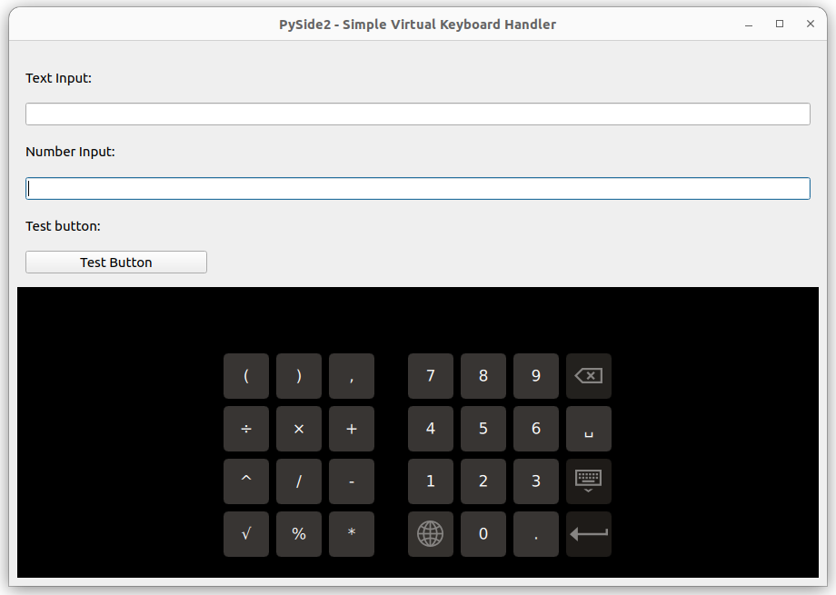

# VirtualKeyboard
PySide2, PyQt5 - Simple Virtual Keyboard Handler

This simple application is an example of how to dock a virtual keyboard in a desktop application. The main idea is to create a virtual keyboard as a QWiget using a QML file and dock it in a single QFrame.

The keyboard display is controlled by signals, which are additionally responsible for the animation of the window in which the virtual keyboard is positioned. Also included is the ability to switch the keyboard from regular mode to numeric keypad mode using the appropriate flags.

The application was developed under Linux, there may be problems when running under Win or macOS. By default, the application should be run through the terminal.

environment:
- python: 3.9.0
- PySide2: 5.15.2.1

*Figure 1. Example of virtual keyboard.*

*Figure 2. Example of the virtual keyboard in numeric mode.*

*Figure 3. Hidden virtual keyboard.*

